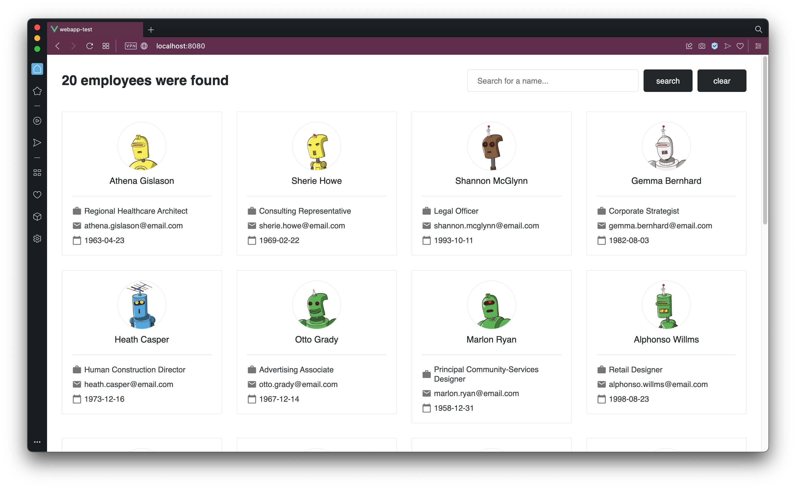
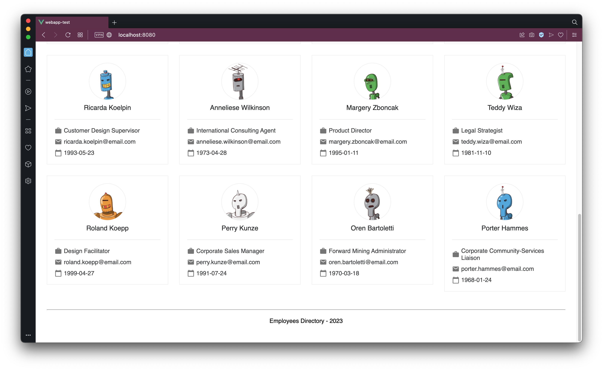
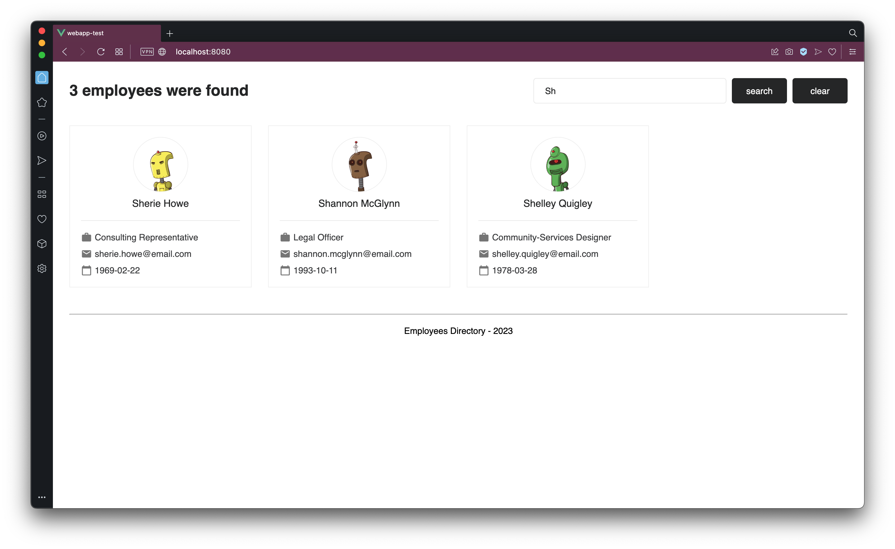
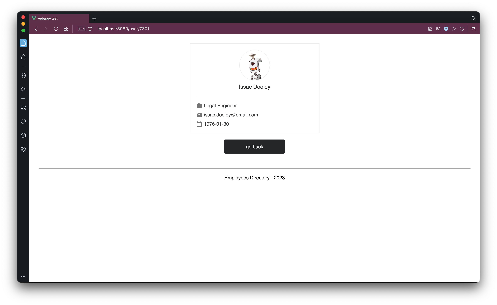
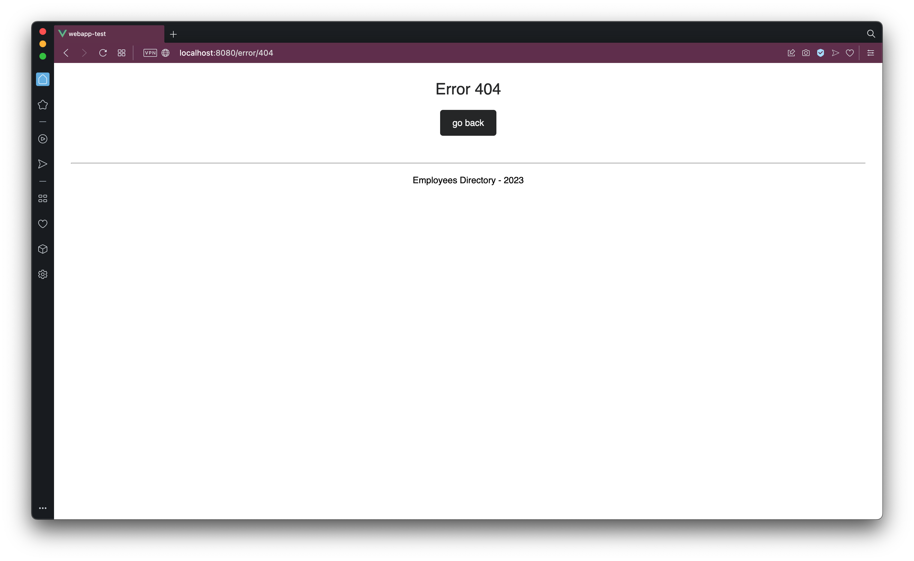
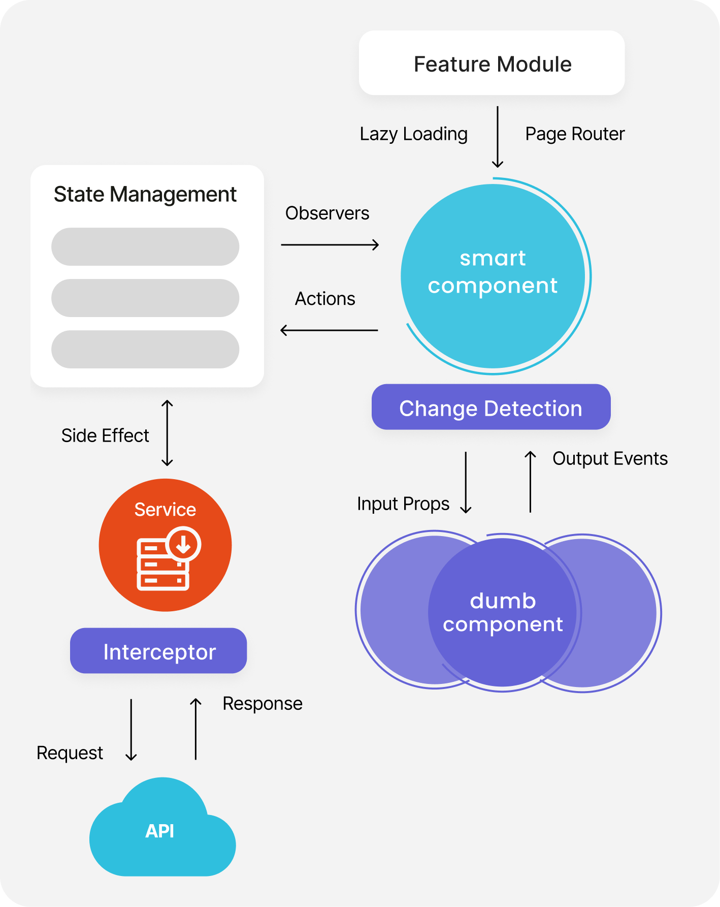

Front-end Code Practical - Question Bank
========================================

Test Info
---------

### Time

You can complete the task at your own leisure, within a 24 hour period. You need to submit your solution within 24 hours.

The task should only take an hour or two.

### How to submmit your solution

You will need to upload your solution to a personal hosting, for example a personal GitHub repository or as an archive file on DropBox, etc.

_Ensure that it is publicly accessible!_

### Where to submit your solution

Send the public link to your solution back to the email address which sent you this question bank before the end of the allocated time.

- - - - - -

Setup
-----

Pull the Git repository at <https://bitbucket.org/culturate/frontend-code-practical>.

It contains two sub-directories: `mock_api` and `webapp`.

The `mock_api` directory contains an existing project which mocks a simple API. Follow the instructions in `mock_api/README.md` to set it up and get it running. _You do not need to edit anything in the `mock_api` project_ - just get it running for your web application to use it.

The `webapp` directory is mostly empty. **Put your submission to this challenge in this project directory**.

- - - - - -

Challenge
---------

To create a web application that interacts with the provided mock API and provides the functionality listed below.

### Notes

* You are free to implement any visual UI design that you like. You want to make it easy to navigate, but don't need to go too overboard on design - see the example screenshots below for an example.
* Take care in your code style - ensure your code is legible!

Requirements
------------

### 1. Framework

You should use one of the following web application frameworks:

* Vue _(preferred)_
* React
* Angular

### 2. API

Your web application will consume the local mock API, provided in the repository in the sub-project under `mock_api` directory.

Follow the instructions in `mock_api/README.md` to start the mock API locally. Point your webapp to use the local API address of the mock API.

See the documentation in `mock_api/README.md` for API documentation.

### 3. Routes / Pages

#### 3.1 Home Page

**Path:** `/`

Displays a title bar with the total number of employees and a search text box for searching by name. 

Below the title bar is a grid of cards showing the profile picture, name, job title, email and date of birth of each employee.

At the bottom of the page is a footer with the text "Employees Directory - 2023".

Example - Top of Home page:

Example - Bottom of Home page:

When searching for text in the search box, the list of users is filtered to only show employee cards which match the search text. The title bar with the total number of employees is updated to show the count of matching employees.

Example - Search on Home page:

#### 3.2 User Details Page

**Path:** `/user/<id>`

Displays just the details card for that particular employee. Also has a "Go Back" button to return back to the list of all employees.

The bottom of this page also shows the same footer as in [3.1 Home Page](#31-home-page).

Example - User Details page:

#### 3.3 Error Page

**Path:** `/error/404`

An error page which is shown in the event that a non-existent page or user is accessed. Displays the message "Error 404", a "Go Back" button which takes you back to the [3.1 Home Page](#31-home-page) and the same footer as the other pages.

Example - Error page:

### 4. Architecture

You should consider (where relevant and/or possible) the concepts in the following architecture diagram when designing and structuring your web application:

